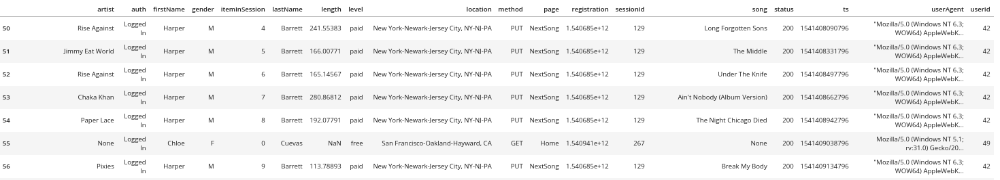

# Project Overview

In this project, we build a data warehouse to analysis the activity on a music app: Sparkify by artists, songs, users over time. We do so using a star schema data warehouse architecture with dimensions: artists, songs, users, time with facts being the activity by the user of playing songs from the app.

# Data

The data for the project includes 2 datasets:

- ### Song dataset
  This data is a subset of the real data from the [Million Song Dataset](http://millionsongdataset.com/). Each file is in JSON format and contains metadata about a song and the artist of that song. The files are partitioned by the first three letters of each song's track ID. For example, here are filepaths to two files in this dataset.
  ```
  song_data/A/B/C/TRABCEI128F424C983.json
  song_data/A/A/B/TRAABJL12903CDCF1A.json
  ```
  Below is the example of the content of a single file:
  ```
  {"num_songs": 1, "artist_id": "ARJIE2Y1187B994AB7", "artist_latitude": null, "artist_longitude": null, "artist_location": "", "artist_name": "Line Renaud", "song_id": "SOUPIRU12A6D4FA1E1", "title": "Der Kleine Dompfaff", "duration": 152.92036, "year": 0}
  ```
- ### Log dataset
  This data consists of log files in JSON format generated by this [event simulator](https://github.com/Interana/eventsim) based on the songs in the dataset above. The log files in the dataset you'll be working with are partitioned by year and month. For example, here are filepaths to two files in this dataset.
  ```
  log_data/2018/11/2018-11-12-events.json
  log_data/2018/11/2018-11-13-events.json
  ```
  Below is the example of how the data looks liks in the log file:
  


# Setting up your environment for the project

## Prerequisites
- postgres: if not pre-installed, download [here](https://www.postgresql.org/download/)

## Getting started

#### Clone the repository
```
$ git clone https://github.com/pranavdixit8/data-modeling-with-postgres.git
```
#### Set up your environement and install all the dependencies
```
$ virtualenv dend-project1
$ source dend-project1/bin/activate
$ pip install -r requirements.txt
```
#### Create the kernel for the virtual environment
```
$ ipython kernel install --user --name dend-project1 
```
Note: Use the kernel ***dend-project1*** while using jupyter notebook

## Commands

##### Create the database and tables
```
$ python create_table.py
```
 
##### Perform etl and insert data into tables
```
$ python etl.py
```

# Files

 - ***sql_queries.py***: this file contain all the sql queries for creating, inserting, and droping the tables in the database and required selection query for our design
 - ***create_tables.py***: this file creates the database and the tables (fact and dimension table of the star schema), it uses the file: *sql_queries*.
 - ***etl.py***: this file execute the etl process for our project: loading the files in dataframes, modifying the data and inserting the data in the tables.
 - ***test.ipynb***: this is the jupyter notebook to test if the table were created as expected and values inserted into the table.
 - ***etl.ipynb***: this jupyter notebook involves loading a single file into the database before moving to load all the files in the database.


# Design


### Fact Table

 - ***songplays***: 
 > Columns: songplay_id, start_time, user_id, level, song_id, artist_id, session_id, location, user_agent
 > >
 > >Primary key: songplay_id

### Dimension Tables

 - ***artists***:
 > Columns : artist_id, name, location, latitude, longitude
 > >
 > >Primary key : artist_id
 
 - ***songs***:
 > Columns: song_id, title, artist_id, year, duration
 > >
 > >Primary key: song_id
 
 - ***users***:
 > Columns: user_id, first_name, last_name, gender, level
 > >
 > >Primary key: user_id
 
 - ***time***:
 > Columns: start_time, hour, day, week, month, year, weekday
 > >
 > >Primary key: start_time
 

 
 